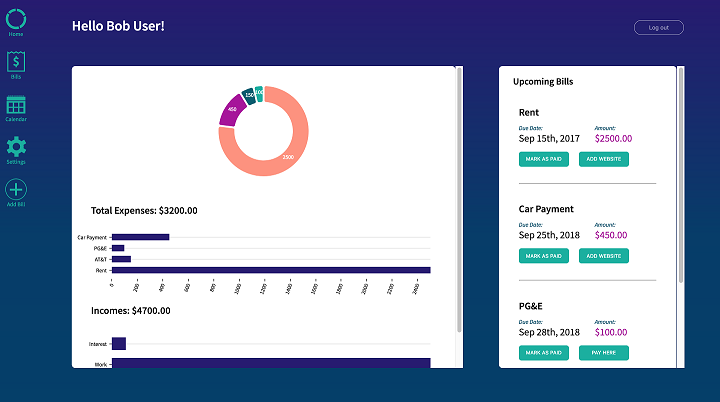
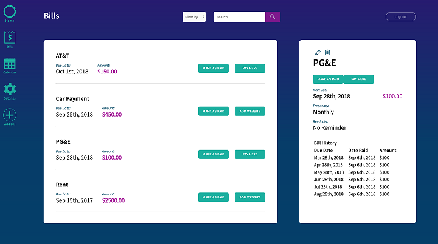

# Welcome to Acceptable Losses!
          
With our app, you can keep track of all of your bills, see due dates of upcoming bills, click a button to
visit your bill's payment website and mark them as paid. Staying on top of your expenses is as easy as hitting
a button!!
        

__________________________
## Below are links to the live app and GitHub Repo for the server side:
* [Live App](https://acceptable-losses-client.herokuapp.com)

  Demo Login: 
    - Username: DEMO@gmail.com
    - Password: password

* [Server Repo](https://github.com/thinkful-ei21/acceptable-losses-server)

__________________________
## Screenshots

### Desktop View

### Mobile View

![[MOBILE]Dashboard](src/assets/README/summary-M.png)![[MOBILE]User Settings](src/assets/README/user-settings-M.png)![[MOBILE]Add Bill Form](src/assets/README/add-new-bil-M.png)
_________________
## Tech Stack

### Acceptable Losses is built using the following:

Technologies that made all of this possible...
* JavaScript
* React
* Redux
* Nivo
* Moment
* Big Calendar
* HTML
* Redux Form
* Redux Thunk
* React-Router
* CSS Modules
* JSON Web Token
* CSS
* Enzyme
* Jest
__________________________
## Project's Key Parts Locations

### Client-Side
* Actions
* Assets
* Components 
* Local Storage
* Reducers
* Store
* Styles
* Tests
* Validators

## Dev Setup:

* Clone both reops (this one and the [Server Repo](https://github.com/thinkful-ei21/acceptable-losses-server))

* Once you have them cloned run `npm install` on both in order to get all dependancies.

* Let the coding begin.. :)

